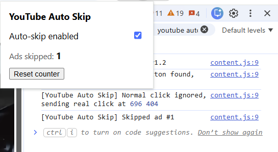
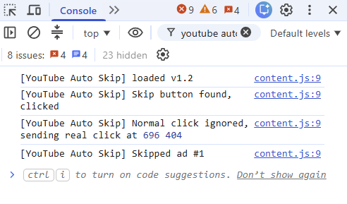

# YouTube Auto Skip

**Clicks YouTube's "Skip Ad" button for you, the moment it appears.**

You know the moment: an ad starts, you wait five seconds, and you reach for the mouse or remote just to press *Skip*. This small browser add-on does that click for you, usually within half a second, so you can keep eating, cooking or working without breaking focus.

It doesn't block ads or change how YouTube works. It simply presses the same Skip button you'd press yourself.

  

---

## ✨ What it does

- **Skips ads instantly:** clicks the Skip button as soon as it appears
- **Closes banner ads:** dismisses the small pop-up ads over videos
- **Counts skipped ads:** shows how many ads it has skipped for you
- **On/off switch:** pause it anytime
- **Private:** no tracking, no accounts, nothing leaves your computer

---

## 🚀 How to install (no technical knowledge needed)

It takes about 2 minutes. It works in **Google Chrome**, **Microsoft Edge** and **Brave**.

### Step 1: Download it
1. At the top of this page, click the green **Code** button.
2. Click **Download ZIP**.
3. The file `yt-auto-skip-main.zip` will save to your **Downloads** folder.

### Step 2: Unzip it
1. Open your **Downloads** folder.
2. **Right-click** `yt-auto-skip-main.zip` and choose **Extract All…**, then click **Extract**.
3. You'll now have a normal folder called `yt-auto-skip-main`.
4. Move this folder somewhere you won't delete it by accident, like your **Documents** folder.

> ⚠️ Don't delete this folder after installing. The browser needs it to stay where it is. If you move it later, you'll need to install again.

### Step 3: Open your browser's extensions page
Copy one of these, paste it into your browser's address bar, and press **Enter**:

| Browser | Address |
|---|---|
| Google Chrome | `chrome://extensions` |
| Microsoft Edge | `edge://extensions` |
| Brave | `brave://extensions` |

### Step 4: Turn on Developer mode
Find the **Developer mode** switch and turn it **on**. In Chrome and Brave it's in the **top-right corner**. In Edge it's on the **left side**.

> This just allows you to install add-ons that aren't from the web store. It's safe and doesn't change anything else.

### Step 5: Load the add-on
1. Click **Load unpacked**. It appears after you turn on Developer mode.
2. Find and select the `yt-auto-skip-main` folder from Step 2. Select the folder itself; you don't need to open it.
3. Click **Select Folder**.

You'll see **YouTube Auto Skip** appear in your list of extensions. 🎉

### Step 6: Pin it to your toolbar
1. Click the **puzzle piece 🧩** icon at the top right of your browser.
2. Click the **pin 📌** next to YouTube Auto Skip.

Its icon now stays in your toolbar, where you can check the counter anytime.

---

## ✅ How to check it's working

### The easy way: check the counter
1. Watch a few YouTube videos until an ad with a **Skip** button appears. It should disappear almost instantly.
2. Click the **YouTube Auto Skip** icon in your toolbar.
3. The **Ads skipped** number should have gone up.

### The detailed way: check the console *(optional)*
If you want to see exactly when it skips an ad:

1. Open a YouTube video.
2. Press **F12** (or right-click anywhere on the page → **Inspect**).
3. Click the **Console** tab.
4. When an ad is skipped, you'll see a message like `[YouTube Auto Skip] Skipped ad (#1)`.

  

Close the panel by pressing **F12** again.

---

## ❓ Common questions

**Is it safe?**
Yes. It only runs on youtube.com, doesn't collect any information, and never connects to the internet on its own. All the code is in this repository for anyone to check.

**Why does my browser show a warning about developer mode extensions?**
Some browsers show this for any add-on not installed from their web store. It's normal. You can close the message.

**Will it skip every ad?**
No. It can only skip ads that have a **Skip** button. Ads without one will still play, just like normal.

**Does it work on my TV, phone or tablet?**
No. It only works in a web browser on a computer (Windows, Mac or Linux).

**How do I turn it off?**
Click its icon in the toolbar and untick **Auto-skip enabled**. To remove it completely, go to your extensions page (Step 3) and click **Remove**.

**It stopped skipping ads. What do I do?**
YouTube sometimes changes its website, which can stop the add-on from finding the Skip button. Please [report it here](https://github.com/vipercipher/yt-auto-skip/issues) and it will be updated. If you're comfortable with a bit of code, see *For developers* below.

---

## 🔒 Privacy & permissions

| Permission | Why it's needed |
|---|---|
| Access to `youtube.com` | To find and click the Skip button. It doesn't run on any other website. |
| `storage` | To remember your on/off setting and skip count, saved only on your computer |

No data collection, no analytics, no network requests.

---

## 👩‍💻 For developers

| File | Purpose |
|---|---|
| `manifest.json` | Extension settings: runs on youtube.com only |
| `content.js` | Watches the YouTube player and clicks the Skip button |
| `popup.html` / `popup.js` | The on/off switch and skip counter |

`content.js` uses a **`MutationObserver`** to react instantly when the player changes, a **0.5-second check** as a fallback (the button sometimes fades in without a page change), a **visibility check** so it only clicks buttons actually on screen, and **multiple selectors**, because YouTube uses different names for the Skip button.

**If YouTube renames the button:** right-click the Skip button → **Inspect**, copy its class name, add it to `SKIP_SELECTORS` at the top of `content.js`, and click ↻ reload on the extensions page.

---

## 🤝 Contributing

Found a bug, or noticed YouTube changed something? [Open an issue](https://github.com/vipercipher/yt-auto-skip/issues) with your browser name and what happened. Pull requests are welcome.

---

## 💬 A note on creators

Ads help fund the creators you watch. This tool only saves you a click on ads YouTube already lets you skip. If you enjoy a channel, consider supporting it directly through memberships, Patreon or YouTube Premium.

---

## 📄 License

[MIT](LICENSE) © Jay

*Not affiliated with or endorsed by YouTube or Google.*